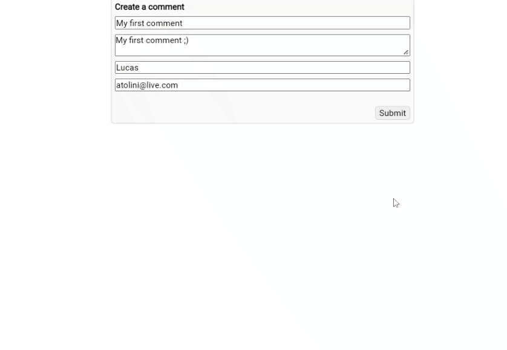
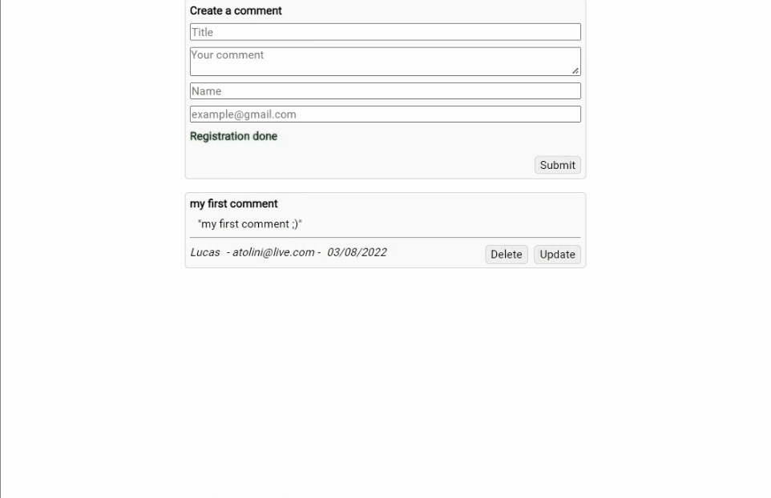
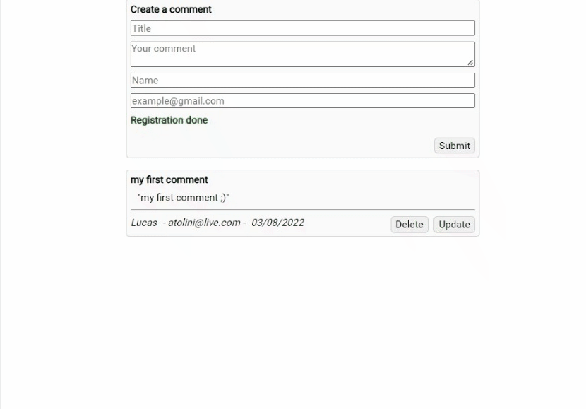

# Dio - Consumindo API REST com React (CRUD). 

Projeto para o Módulo VI - Back-end: Criando API com Node.js do bootcamp Impulso Javascript Evolution uma parceria da [Dio](https://www.dio.me/) e [Impulso](https://impulso.network/). 

## Índice de conteúdo

- [Overview](#overview)
  - [O Desafio](#o-desafio)
  - [Screenshots](#screenshots)
  - [Esse projeto não é](#esse-projeto-não-é)
  - [Detalhes](#detalhes)
- [Meu processo](#meu-processo)
  - [Bibliotecas](#bibliotecas)
  - [O que aprendi](#o-que-aprendi)
- [Autor](#autor)

## Overview

### O desafio

Construção de uma simples API com Express e TypeORM para consumo com React. Funcionalidades: 

- Enviar dados para o back-end; 
- Deletar dados;
- Atualizar dados; 

### Screenshots

Enviando dados:

Atulizando:

Deletando:

### Esse projeto não é

O projeto não é para demonstrar capacidades de estilização, responsividade e validação de formulários. Tem o único objetivo de demonstrar domínio na interação back-end e front-end pela arquitetura RESTful.

### Detalhes

- Para inicializar o servidor Express "npm run dev" no dir "back-end". 
- Para inicializar o front-end "npm start" no dir front-end. 

## Meu processo

### Bibliotecas

- [Express](http://expressjs.com/pt-br/) - Gestor de rotas
- [TypeORM](https://typeorm.io/) - ORM
- [React](https://reactjs.org/) - JS lib
- [React Query](https://tanstack.com/query/v4/?from=reactQueryV3&original=https://react-query-v3.tanstack.com/) - Caching
- [Axios](https://axios-http.com/ptbr/docs/intro) - HTTP Client
- [Styled Components](https://styled-components.com/) - Estilização

### O que eu aprendi

- Fazer solicitações AJAX; 
- Gerenciar cache e refetching com React Query;
- Arquitetura MVC;
- Introdução a programação back-end com TypeScript;
- ORM;

## Autor

- E-mail: <atolini@live.com>

